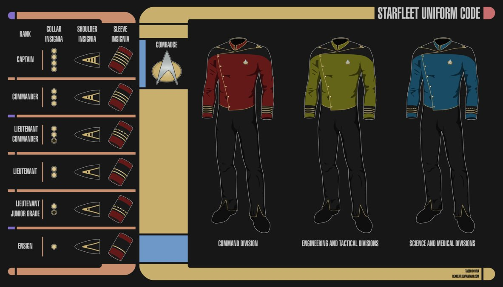

STAR LOGS
---------

## Welcome to Starfleet!

We need you to build a new system for starfleet to use to keep track of the captains logs.

Some things we need to have
  - Users must be able to login with a username and password
  - When a user registers with starfleet they will also have to set a ship which they are a part of
  - After loging in they are provided with thier ships logs
  - Any role can create a log, and any user can comment on any log
  
 ### What this means for you
 
 You will need the following schema's:
  - Ship
  - User
  - Log
  - Comment
    
Relationships are as follows
  - Users have an assigment (shipId)
  - Logs will have an author (userID) and a ship (shipID)
  - Comments will have a log they are attached to (logId) and author (userID)
 
Data Rules
  - Users can only see logs, and create logs if they are logged in
  - Only the author can edit logs
